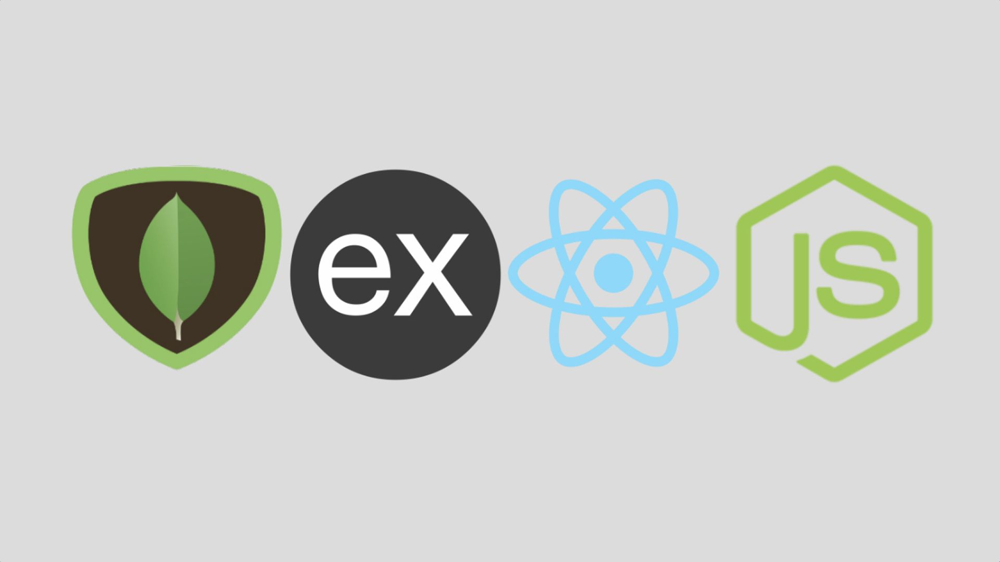
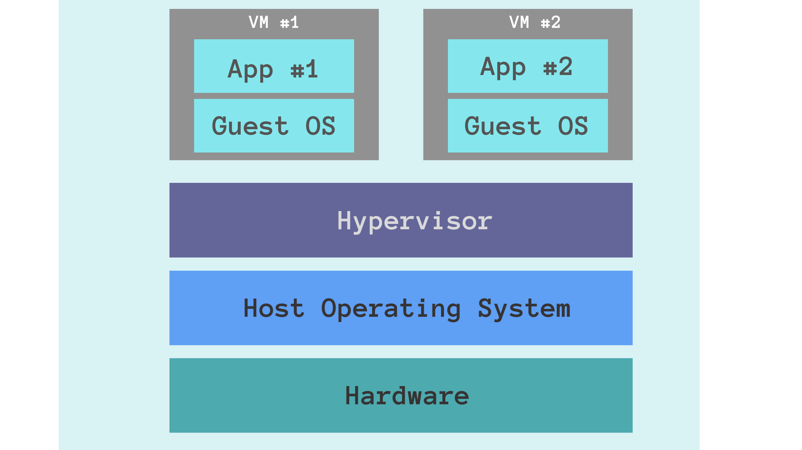
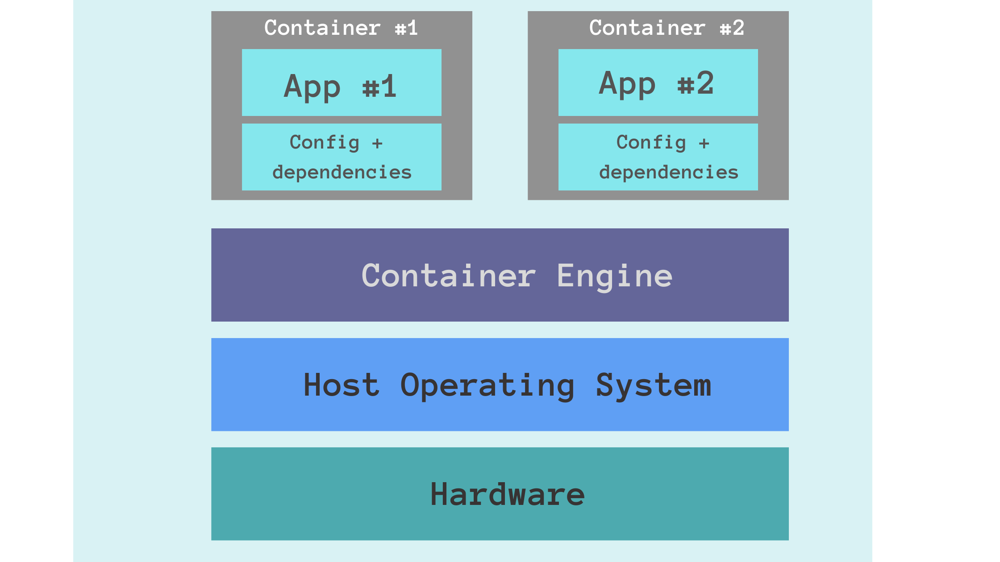
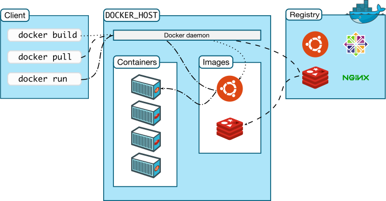

<!-- paginate: true
_backgroundColor: lightblue -->

# Agenda

- Docker alternative (VMs)
- Docker overview
- Docker architecture
- Docker installation
- Docker objects (images, containers, volumes)
- Docker compose

---

# Question

How would to deploy such application **_across all Operative Systems_**?

---



---

# Proposal

We could use VM (Virtual Machine) or Docker.

---

# Overview

Docker is an open-source platform for developing, shipping, and running applications.

Docker enables you to separate your application from your infrastructure so you can deliver software quickly.

---

Docker provides the ability to **_package and run applications_** in a loosely isolated environment called a container.

Containers are lightweight and contain everything needed to run the application, so you do not need to rely on what is currently installed on the host.

---

Docker streamlines the development lifecycle by allowing developers to work in standardized environments using local containers which provide your applications and services.

Containers are excellent for continuous integration and continuous delivery (CI/CD) workflows.

---

# Docker vs VM comparison

- Image Size
  Docker Images are generally smaller

- Scalability
  Docker Containers are easier to scale

- Performance
  Docker Containers are less resource-intensive and boot-up in few milliseconds

- Portability
  Docker Containers behave the exact same way across all Operative Systems

---



---



---

# Docker architecture

---

Docker uses a client-server architecture. The Docker client talks to the Docker daemon, which does the heavy lifting of building, running, and distributing your Docker containers.

The Docker client and daemon can run on the same system, or you can connect a Docker client to a remote Docker daemon.

---



---

# Docker client

The Docker client is the primary way users interact with Docker.

When you use commands such as `docker run`, the client sends these commands to **dockerd**, which carries them out.

---

# Docker engine

The Docker daemon (dockerd) listens for Docker API requests and manages Docker objects such as images, containers, networks, and volumes.

The docker daemon is also referred as docker engine.

---

# Docker registry

A Docker registry stores Docker images. [Docker Hub](https://hub.docker.com/) is a public registry, configured to look for images on Docker Hub by default.

---

# Docker objects - images

An image is a template with instructions for creating a Docker container.

Often, an image is based on another image, with some additional customization.

---

# Docker objects - containers

A container is a runnable instance of an image. You can create, start, stop, move, or delete a container using the Docker API or CLI.

You can connect a container to one or more networks, attach storage to it, or even create a new image based on its current state.

---

A container is defined by its image as well as any configuration options you provide to it when you create or start it.

**_When a container is removed, any changes to its state that are not stored in persistent storage disappear._**

---

# Docker objects - volumes

Volumes are the preferred mechanism for persisting data generated by Docker containers, because they are completely managed by Docker.

---

# Docker installation

https://docs.docker.com/engine/install/

---

# First docker command

```bash
# "sudo" for Linux-based systems
sudo docker run hello-world
```

---

# Basic docker commands

```bash
docker stats # provides live resource usage
docker version/info # prints client-server details
docker help # showcases commands available

docker images # lists local images
docker ps # lists running containers
docker ps -a # lists all containers
docker run <image_name> # instantiates (or runs) an image
```

---

# Interacting with containers

```bash
docker run debian
docker run debian bash
docker run -it debian bash

docker ps

docker run -itd debian bash
docker exec -it <Cont_ID> bash
```

---

# Docker container lifecycle

```bash
docker ps # lists running containers

docker run <Image_Name> # running

docker stop <Cont_ID> # stopped
docker start <Cont_ID> # running

docker stop <Cont_ID> # stopped
docker rm <Cont_ID> # removed (along with non-persistent content)
```

---

# Let's deploy Jenkins inside a container

```bash
docker run -p 8080:8080 jenkins/jenkins

# on separate terminal execute
docker exec <Cont_ID> cat /var/jenkins_home/secrets/initialAdminPassword
docker exec -itu root <Cont_ID> bash
apt install build-essential
```

---

# Building Docker images

We build Docker images using `Dockerfile`.

A Dockerfile is a text document that contains all instructions to assemble an image.

---

```bash
git clone https://github.com/UnderGrounder96/node-hello-world

cd node-hello-world

docker build -t node-app:v1 .
docker run -p 9000:9000 node-app:v1
```

---

# Building a multi-container setup

```bash
git clone https://github.com/UnderGrounder96/rentAcar

cd rentAcar

cp .env.default .env

sed -i 's/DB_HOST=localhost/DB_HOST=db/' .env

docker-compose up
```

---

# Docker use-cases

- Easier team on-boarding
- Increase developers productivity
- DevOps (CI/CD) integration
- Infrastructure isolation
- Microservice/Cloud migration

---

# Docker downside

- Specific OS/Kernel configuration
  Because Docker uses the Host Kernel, specific Kernel application would require additional testing. Under different OS, for example.

- Legacy/monolithic app migration to Docker
  Apps not created with Cloud-Native approach require restructuring.

- Desktop/GUI applications
  Extra configuration is needed for Desktop/GUI applications.

- Software isolation
  Docker uses the resources provided by the Host OS, so hosts processes may impact container processes. For true isolation VM is preferred.

---

# Summary

- Docker overview and architecture
- Docker Objects (images, containers, volumes)
- Docker CLI (build, pull, run, exec, stop, start...)
- Docker Compose
- Docker pros and cons

---

# Content not mentioned

- Docker scalability
- Docker Swarm
- Docker inside Docker
- MacOS inside Docker
  https://github.com/sickcodes/Docker-OSX

---

# Next steps

https://docs.docker.com/reference/
https://docs.docker.com/get-started/

---

# Bonus: Docker clean-up

```bash
docker ps | awk '{print $1}' | sort -r | xargs docker stop 2>/dev/null
docker system prune --all --force --volumes
```

---

# Homework

"Dockerize" this project:

```bash
https://github.com/UnderGrounder96/factorial_cpp

1 - Create Dockerfile
2 - Create docker-compose.yml
3 - Submit a PR
```
